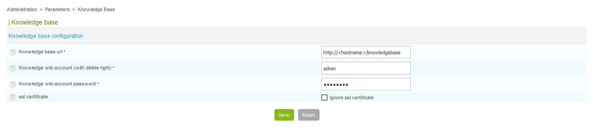
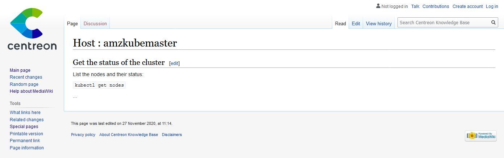
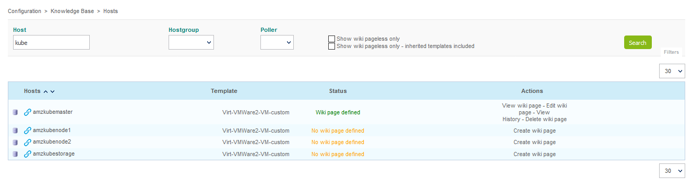
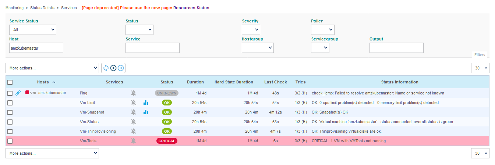

## Introduction

In Centreon Open Source suite since 2.8.0 version, **Knowledge Base** allow you
to easily associate a wiki with Centreon Web.

It creates links between hosts and services and specific procedure on a Wiki.

To make things more flexible, procedures can be associated with templates.

**Knowledge Base** is the solution to easily link a Wiki to Centreon.

## Prerequisites

**Centreon Knowledge Base** requires a **MediaWiki** (version >= 1.31).

You can install it on a dedicated server, or just on the Centreon Central
server.

The following procedure describes how to install the version 1.34.4 on
the Central server.

> MediaWiki 1.35 cannot be installed on the Central server as it requires
> PHP 7.3.

### Copy the source files

Download the source archive from the official MediaWiki website with
the following command:

```shell
wget https://releases.wikimedia.org/mediawiki/1.34/mediawiki-1.34.4.tar.gz
```

Unarchive and copy the files to the final directory:

```shell
tar xvf mediawiki-1.34.4.tar.gz
mv mediawiki-1.34.4 /usr/share/mediawiki
```

### Create the web server configuration

To access the MediaWiki using the same Apache web server, add the following
configuration to a dedicated configuration file like
`/etc/httpd/conf.d/11-mediawiki.conf`:

```apacheconf
Alias /knowledgebase /usr/share/mediawiki

<LocationMatch ^/knowledgebase/(.*\.php(/.*)?)$>
  ProxyPassMatch fcgi://127.0.0.1:9042/usr/share/mediawiki/$1
</LocationMatch>

ProxyTimeout 300

<Directory "/usr/share/mediawiki">
    DirectoryIndex index.php
    Options Indexes
    AllowOverride all
    Order allow,deny
    Allow from all
    Require all granted
    <IfModule mod_php5.c>
        php_admin_value engine Off
    </IfModule>

    AddType text/plain hbs
</Directory>
```

> You can adapt the configuration to your needs, if you want to change the
> base URL or if you copied the source files in another directory.

Reload Apache with the following command:

<!--DOCUSAURUS_CODE_TABS-->

<!--CentOS 8-->

```shell
systemctl reload httpd
```

<!--CentOS 7-->

```shell
systemctl reload httpd24-httpd
```

<!--END_DOCUSAURUS_CODE_TABS-->

### Proceed to MediaWiki installation

MediaWiki can be installed from a command line.

The following command will create the required database on the same MariaDB
instance than Centreon.

`<hostname>` must be replaced with the hostname used to access the web UI.

The command should be executed from within the final directory,
`/usr/share/mediawiki` in this example.

```shell
php maintenance/install.php \
    --dbserver localhost \
    --installdbuser root \
    --dbuser wiki \
    --dbpass wiki \
    --dbname knowledge_base \
    --confpath '/usr/share/mediawiki' \
    --server 'http://<hostname>' \
    --scriptpath '/knowledgebase' \
    --pass centreon123 \
    'Knowledge Base' \
    admin
```

The command should result to the following:

```shell
PHP 7.2.24 is installed.
Warning: Could not find APCu or WinCache. Object caching is not enabled.
Found GD graphics library built-in. Image thumbnailing will be enabled if you enable uploads.
Git version control software not found. You can ignore this for now. Note Special:Version will not display commit hashes.
Using server name "http://localhost".
Using server URL "http://<hostname>/knowledgebase".
Warning: Your default directory for uploads (/usr/share/mediawiki/images/) is not checked for vulnerability to arbitrary script execution during the CLI install.
Using the PHP intl extension for Unicode normalization.
The environment has been checked. You can install MediaWiki.
Setting up database
done
Creating tables
done
Creating database user
done
Populating default interwiki table
done
Initializing statistics
done
Generating secret keys
done
Prevent running unneeded updates
done
Creating administrator user account
done
Creating main page with default content
done
Database was successfully set up
MediaWiki has been successfully installed. You can now visit <http://<hostname>/knowledgebase> to view your wiki. If you have questions, check out our frequently asked questions list: <https://www.mediawiki.org/wiki/Special:MyLanguage/Manual:FAQ> or use one of the support forums linked on that page.
```

> Run the following command to get a hint on all available options:
>
> ```shell
> php maintenance/install.php --help
> ```

You can now access to the MediaWiki using the mentionned URL.

## Configure access to the Wiki from Centreon

Before starting with **Knowledge Base**, you need to configure Centreon
to access the Wiki API.

For this go to `Administration > Parameters > Knowledge Base` and complete
the form:



> The `admin` account from installation process is used here.
>
> As the "delete right" is only available with users members of
> `Administrators` group, you must either use this account or create another
> one member of this group.

## User guide

### Definition

A procedure is basically a technical documentation allowing operators to know
what to do when an alert is raised in Centreon.

Procedures can be of different natures:

-   Describe actions to solve a problem,
-   Escalate the issue to another team,
-   Open a support ticket,
-   Warn users that a specific service is down.

A procedure can be defined for an host or a service.



### Displayed procedure: template and overload

To avoid too much workload on the procedure deployment, the
functionality allows administrator to setup a single procedure for
hosts/services.

So a procedure can be specified for a given host/service but can be
specified as well for a host/service template.

If a procedure is defined at template level, all children of the
template will have the procedure attached as well unless overloaded by a
specific one. The mechanism is identical to template system in Centreon
with inheritance.

**Knowledge Base** function is designed to avoid adding or updating
manually several times the same procedure in knowledge base.

When a user clicks on a host procedure:

-   If a specific procedure is defined for this host, its wiki page is
    displayed,
-   If no specific procedure is defined bu the host template has a
    procedure, the host template wiki page is displayed,
-   If host template has no procedure defined, parents template will be
    checked for a defined procedure,
-   Finally if no procedure is defined in the template tree, a message
    will warn that there is no procedure defined for this host.

It’s the same for services.

### Create / Update / Delete a procedure

Go to `Configuration > Knowledge Base` sub-menus to:

-   List Hosts / Services / Host Templates / Service Templates and
    attached procedures,
-   Create / View / Edit / View history for a Host / Services / Host
    Templates / Service Templates,
-   List Hosts / Services / Host Templates / Service Templates without
    procedure defined.



> To delete a procedure link for specific host / service / template,
> edit the object and empty the **URL** field in **Extended
> Information** tab.
>
> If the object inherits from any template of a procedure, the empty
> value will overload and delete the procedure link.

### Link from Centreon UI

The technical procedure is available in Centreon UI through a link icon:



By clicking on link icon, the user is redirected to the corresponding
procedure.

If the link icon is on the left of a host name, the wiki page containing
the procedure for the host will be displayed.

If the link icon is on the right of a service name, the wiki page
containing the procedure for the service will be displayed.

### Synchronization

There’s a cron job that updates hosts, services and hosts/services
templates configuration.

For example, if you create a page in the wiki using the usual pattern
(ex: `Host:Centreon-Server` or `Service:Centreon-Server Disk-/`), the
cron will add the link to the page in the **URL** field of object’s
extended information.

### Best practice for deployment

To deploy procedures in the best way, we strongly advice you to use the
multi level inheritance system.

The best practice is to define procedures at template level as much as
you can.

Here is an example of an host template configuration tree:

-   Linux \> Generic-hosts
-   Windows \> Generic-hosts
-   RedHat \> Linux
-   Debian \> Linux
-   Active-Directory \> Windows
-   LDAP \> Linux

To setup procedures for the *RedHat* host template, just proceed as
indicated in [Link from Centreon UI](#link-from-centreon-ui).

In the template tree we see that the **RedHat** template inherits from
two other templates: **Linux** and **Generic-hosts**. In this example
all hosts using the *RedHat* host template will have the new procedure
defined attached.

We could setup a procedure at a higher level in the template tree, it
will impact more hosts.

For example if we define a procedure for **Linux** host template, all
hosts using **RedHat**, **Debian** and **LDAP** host templates will have
the procedure attached by inheritance. Because **Linux** is the parent
template.

Behavior is the same for service templates.
